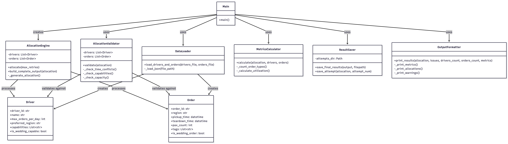

# grain-project

<a id="readme-top"></a>


## Table of Contents
- [The Challenge: “Smart Delivery Allocator”](#the-challenge-smart-delivery-allocator)
- [Context](#context)
- [Built With](#built-with)
- [Installation](#installation)
- [Usage](#usage)
- [Developer's Guide](#developers-guide)
- [Known Bugs](#known-bugs)
- [Roadmap](#roadmap)
- [Contact](#contact)

---

## The Challenge: “Smart Delivery Allocator”

Build a working prototype of an AI-powered delivery allocation system that intelligently assigns catering orders to delivery specialists based on constraints, priorities, and logistics.

---

## Context

You’re building an internal tool for a catering company (think Grain) that delivers hundreds of orders daily. The operations team currently spends hours manually assigning orders to drivers, trying to balance:

- **Geographic efficiency:** clustering orders by region
- **Time windows:** pickup, setup, teardown constraints
- **Driver preferences and capacity:** regional familiarity, max orders per day
- **Order priorities:** VIP clients, special requirements like pre-setup or weddings

Your task is to create a proof-of-concept that demonstrates how AI can make smart initial allocations, saving hours of manual work and improving logistics efficiency.

<p align="right">(<a href="#readme-top">back to top</a>)</p>

---

## Built With

- [Streamlit](https://streamlit.io/)
- Folium
- Python

---

<p align="right">(<a href="#readme-top">back to top</a>)</p>

## Installation (on Mac)

```bash
git clone https://github.com/yeo-menghan/grain-project.git
cd grain-project
uv init
uv sync
uv pip install -r requirements.txt
source .venv/bin/activate
```

Create a new folder named ./data/.
Add drivers.json and orders.json files under this new folder.

<p align="right">(<a href="#readme-top">back to top</a>)</p>

## Usage

Run the scheduling algorithm
```
python -m allocator.main
```


The scheduling algorithm will produce a `allocation_results.json` under `./data/`. Thereafter, we can observe the allocation details via:
```
streamlit run frontend.py
```


<p align="right">(<a href="#readme-top">back to top</a>)</p>

## Developer's Guide

* LLM usage: GPT-4.1
* Also tested on GPT-4.1-mini but yielded sub-optimal results

### Flowchart of allocation algorithm


### Class diagram of allocation algorithm



<p align="right">(<a href="#readme-top">back to top</a>)</p>

## Known Bugs
- [ ] Suboptimal Openai API Model performance at night with same prompts and set-up (scheduling wrongly, wrong formatting, hallucinating of drivers and orders) 

<p align="right">(<a href="#readme-top">back to top</a>)</p>

## Roadmap

- [x] First MVP (allocator-repeat.py)
- [x] MVP with token tracking and OOP
- [ ] Further test on other LLMs
- [ ] Benchmark against traditional scheduling algorithms - Greedy, PuLP
- [ ] Add more guardrails

<p align="right">(<a href="#readme-top">back to top</a>)</p>

## Contact

* Contact Meng Han via email: yeomenghan1989@gmail.com for any bug reports or extensions for the project


