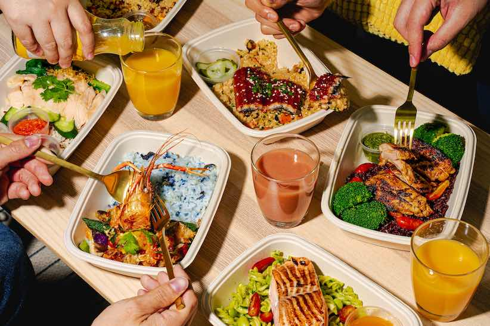
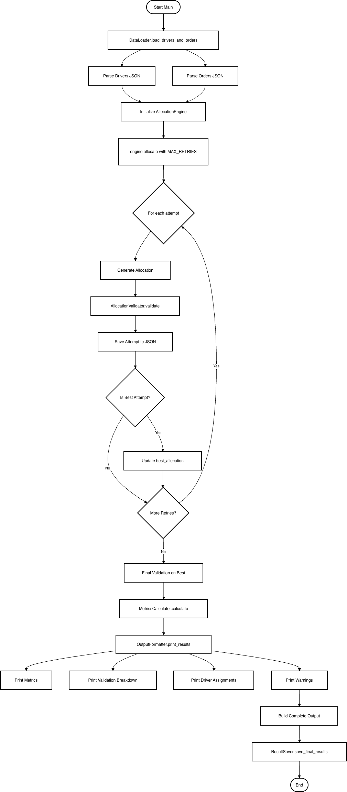

# grain-project



  


<a id="readme-top"></a>

## Table of Contents
- [The Challenge: “Smart Delivery Allocator”](#the-challenge-smart-delivery-allocator)
- [Context](#context)
- [Built With](#built-with)
- [Installation](#installation)
- [Usage](#usage)
- [Developer's Guide](#developers-guide)
- [Known Bugs](#known-bugs)
- [Roadmap](#roadmap)
- [Contact](#contact)

---

## The Challenge: “Smart Delivery Allocator”

Build a working prototype of an AI-powered delivery allocation system that intelligently assigns catering orders to delivery specialists based on constraints, priorities, and logistics.

---

## Context

Building an internal tool for a catering company (think Grain) that delivers hundreds of orders daily. The operations team currently spends hours manually assigning orders to drivers, trying to balance:

- **Geographic efficiency:** clustering orders by region
- **Time windows:** pickup, setup, teardown constraints
- **Driver preferences and capacity:** regional familiarity, max orders per day
- **Order priorities:** VIP clients, special requirements like pre-setup or weddings

The task is to create a proof-of-concept that demonstrates how AI can make smart initial allocations, saving hours of manual work and improving logistics efficiency.

<p align="right">(<a href="#readme-top">back to top</a>)</p>

---

## Built With

- [Streamlit](https://streamlit.io/)
- Folium
- Python

---

<p align="right">(<a href="#readme-top">back to top</a>)</p>

## Installation (on Mac)

1. Clone & Set up virtual environment
```bash
git clone https://github.com/yeo-menghan/grain-project.git
cd grain-project
uv init
uv sync
source .venv/bin/activate
uv pip install -r requirements.txt
```

2. Set up data folder
Create a new folder named `./data/`.
Add `drivers.json` and `orders.json` files under this new folder.

3. rename `sample.env` to `.env` and insert OpenAI api key

<p align="right">(<a href="#readme-top">back to top</a>)</p>

## Usage

Run the scheduling algorithm
```
python -m allocator.main
```


The scheduling algorithm will produce a `allocation_results.json` under `./data/`. Thereafter, we can observe the allocation details via:
```
streamlit run frontend.py
```


<p align="right">(<a href="#readme-top">back to top</a>)</p>

## Developer's Guide

* LLM usage: GPT-4.1
* Also tested on GPT-4.1-mini but yielded sub-optimal results
* Refer to OpenAI's API pricing for other models: [link](https://platform.openai.com/docs/pricing?latest-pricing=standard)

### Project Directory (Allocator)
```bash
allocator/
├── ai/
│ ├── init.py
│ ├── openai_client.py
│ └── token_tracker.py
├── allocation/
│ ├── init.py
│ ├── allocator.py
│ └── validator.py
├── analysis/
│ ├── init.py
│ └── analyzer.py
├── io/
│ ├── init.py
│ ├── loader.py
│ └── saver.py
└── models/
├── init.py
├── config.py
├── driver.py
├── order.py
├── main.py
└── utils.py
data/
frontend.py
allocator_repeat.py (monolithic mvp)
```

### Flowchart of allocation algorithm


### Class diagram of allocation algorithm


<p align="right">(<a href="#readme-top">back to top</a>)</p>

### YouTube Video for quick run down
Accessible through this link: [youtube link](https://youtu.be/EpLn-z_R7UI)


## Known Bugs
- [ ] Suboptimal Openai API Model performance at night with same prompts and set-up (scheduling wrongly, wrong formatting, hallucinating of drivers and orders) 

<p align="right">(<a href="#readme-top">back to top</a>)</p>

## Roadmap

- [x] First MVP (allocator-repeat.py)
- [x] MVP with token tracking and OOP
- [ ] Further test on other LLMs
- [ ] Benchmark against traditional scheduling algorithms - Greedy, PuLP
- [ ] Add more guardrails

<p align="right">(<a href="#readme-top">back to top</a>)</p>

## Contact

* Contact Meng Han via email: yeomenghan1989@gmail.com for any bug reports or extensions for the project

## Acknowledgement
Project image taken from [Grain](https://www.google.com/url?sa=i&url=https%3A%2F%2Fgrain.com.sg%2F&psig=AOvVaw0DpnI2Vy9L2Vmlt7I3atCE&ust=1761699684117000&source=images&cd=vfe&opi=89978449&ved=0CBUQjRxqFwoTCICb5PDYxZADFQAAAAAdAAAAABAE)